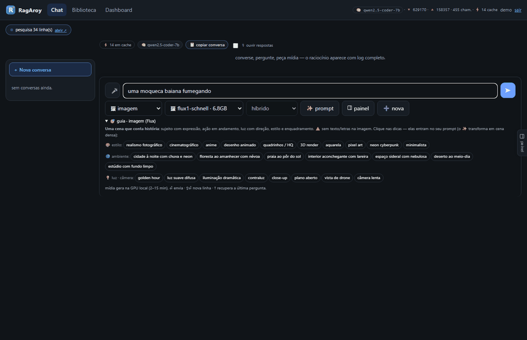
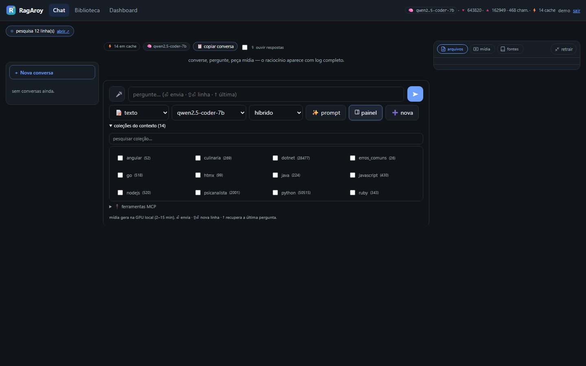
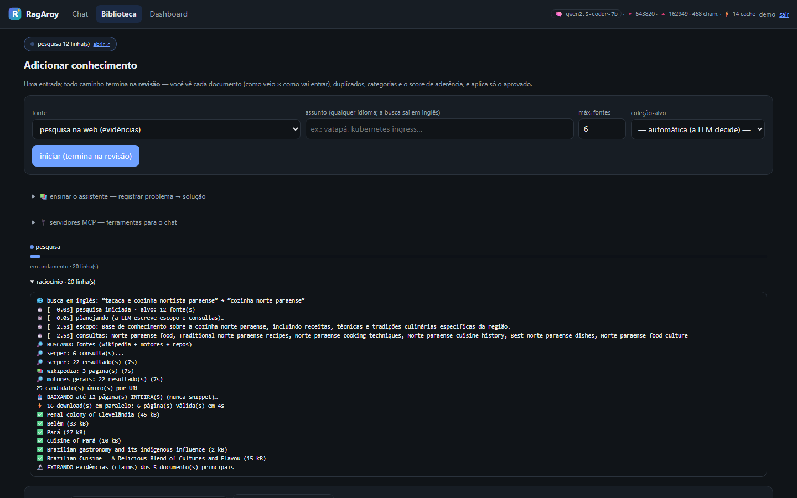
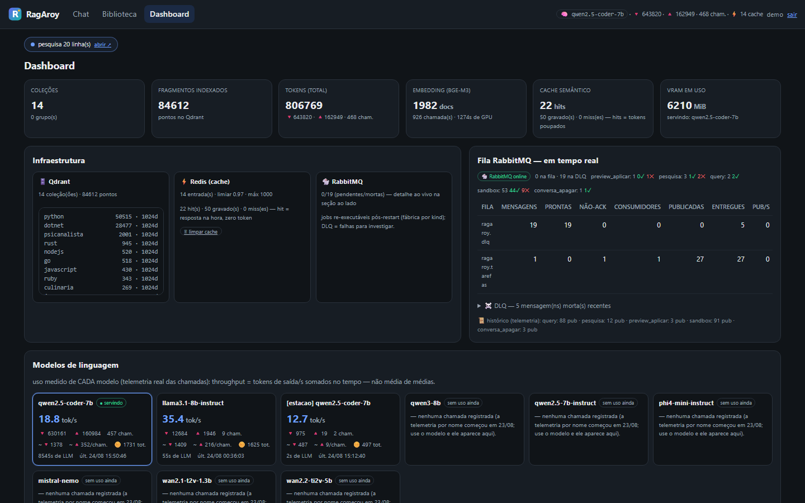
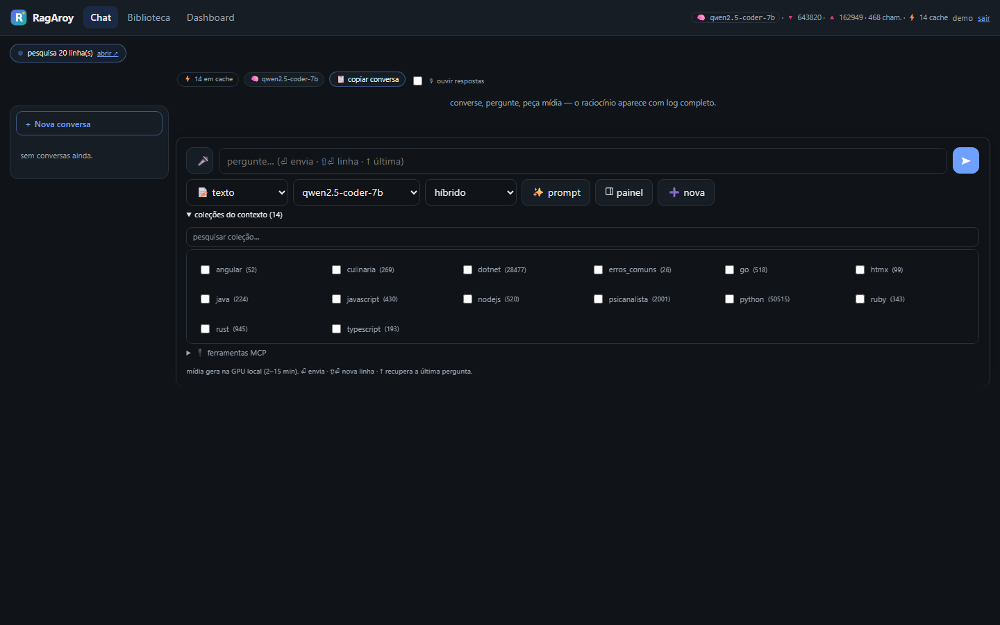
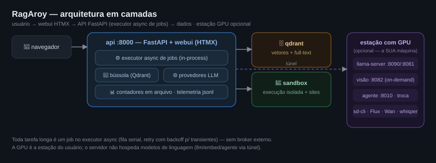

<div align="center">


# RagAroy

**Construa sua própria LLM local: alimente a base com o que VOCÊ precisa (RAG), pergunte e receba respostas com fontes em milissegundos — GPU sua, custo zero por pergunta.**

[](LICENSE)
[](.github/workflows/ci-cd.yml)
[](requirements.txt)
[](#arquitetura)

[O que dá pra fazer](#o-que-dá-pra-fazer) · [Telas](#telas) · [Começo rápido](#começo-rápido) · [Arquitetura](#arquitetura) · [Divulgar](#divulgação)

</div>

---

## A ideia em uma frase

Sua base de conhecimento vira a memória de um modelo local: as perguntas
do SEU domínio respondem **rápido e barato** (busca vetorial + resposta
citando fontes), sem depender de API paga. Provedores externos (GLM,
DeepSeek, OpenAI, Claude) são **complemento pontual** — ligados quando o
assunto está fora do alcance das suas coleções ou das ferramentas MCP.

| | local (RagAroy) | provedor externo |
|---|---|---|
| custo por pergunta | zero (GPU/CPU sua) | por token |
| latência | milissegundos (cache/Qdrant) | segundos |
| conhecimento | suas coleções (RAG) | treino do modelo + web |
| uso ideal | pesquisas centradas no seu domínio, repetidas, com fontes | o que não está nas suas bases nem nos MCPs |



## O que dá pra fazer

**💬 Conversar com seus documentos (o coração)**
- Alimente a base com PDFs, pastas, **datasets do HuggingFace** (agora com vitrine e seleção) e pesquisa web profunda — tudo com **modo Revisão**: nada grava sem aprovação.
- Pergunte em português — a resposta cita os trechos `[n]` e as fontes ficam num painel. Fragmento forte responde **direto da base, zero token**.
- 4 modos: `híbrido` (base + modelo), `rag` (só a base — recusa honesta), `livre` e `auto` (o roteador decide entre base e web).
- Cache semântico (pergunta repetida responde na hora), raciocínio expansível em tempo real, voz (pt-BR) e troca de modelo a quente.

**🔌 Plugar APIs externas (GLM, DeepSeek, OpenAI, Claude…) — quando o RAG não cobre**
- Qualquer endpoint OpenAI-compatible vira um provedor no seletor do chat — basta `PROV_<id>_BASE_URL` + `PROV_<id>_API_KEY` no `.env` (editável na tela Sistema, chave mascarada).
- A lista de modelos é a **REAL do provedor** (`GET /models`); modelos **multimodais** (👁 gpt-4o, claude, glm-4v…) também servem a **análise de imagem** direto pela API externa.
- Regra de bolso: se a resposta demora ou custa e o assunto É da sua base, use o local — o externo é para o que está **fora** das suas coleções e dos MCPs.

**🎨 Gerar imagem e vídeo pela conversa**
- Texto→imagem (FLUX.1), texto→vídeo e imagem→vídeo (Wan 2.1/2.2) e GIF com loop — tudo com progresso ao vivo e o resultado entra na conversa.
- Chips de estilo/ambiente/luz montam o prompt e o ✨ reescreve seu rascunho em storytelling denso; `negativo: <texto>` no pedido vira negative prompt.
- A cena continua a sessão (personagens, ambiente) e mídias geradas viram referência para as próximas.

**⚙️ Executar e ver o código funcionar**
- Cada resposta com código vira um projeto no painel — **▶ testar resposta** roda tudo num container isolado (python, node, java, **.NET 8+10**, rust, ruby, php, go, dart).
- Instala as dependências que o próprio código importa, compila multi-arquivo, detecta o entry point sozinho.
- **Sites ficam no ar**: o teste sobe Flask/FastAPI/ASP.NET, captura a home e publica o app num link temporário (~30 min) para você navegar e compartilhar.

**📚 Construir a base com curadoria**
- Ingestão em **modo Revisão**: nada grava sem você aprovar — vê chunks, quase-duplicados, clusters e um gate de tema antes.
- Seed por assunto (pesquisa profunda com evidências citadas), pesquisa standalone, higienização de coleções antigas.

**🔌 Ferramentas MCP**
- Registre servidores MCP pela UI (catálogo com 1 clique ou URL/comando), marque por conversa — seleção persiste.
- Toda execução passa por **portão de aprovação** e a resposta final é verificada contra o que as ferramentas realmente retornaram.

**📊 Observar tudo**
- Dashboard com uso por modelo (tokens, tok/s, chamadas), infra (Qdrant, Redis, fila RabbitMQ com DLQ) e logs ao vivo.
- Telemetria persistente e histórico de execuções com log completo de cada job.

| Chat (resposta + painel de arquivos com ▶ testar) | Biblioteca |
|---|---|
|  |  |

| Dashboard (modelos, infra, logs ao vivo) | Sistema (config sem restart) |
|---|---|
|  |  |

Mais GIFs de uso real em [`docs/telas/`](docs/telas) — inclusive o [chat em ação](docs/telas/demo-chat.gif).

## Começo rápido

Pré-requisitos: **Docker** + **Python 3.11+**. GPU opcional (~8 GB VRAM recomendada).

```bash
# 1) tudo em um comando (deps + docker + modelos essenciais)
./scripts/setup.sh --modelos chat,embed        # Linux/macOS/WSL
powershell -File setup.ps1 -Modelos chat,embed # Windows

# 2) subir os modelos (llama-server: chat + embedding)
python servicos_llm.py

# 3) abrir http://localhost:8000 e criar o login
```

<details>
<summary><b>Baixando modelos um por um</b> (ou outros tamanhos)</summary>

Um de cada tipo, em `~/models` (ou `D:\models`) — `python scripts/baixar_modelos.py --listar` mostra o catálogo inteiro com comandos prontos:

| Tipo | Modelo | Tamanho |
|---|---|---|
| Conversa | Qwen2.5-Coder-7B Q4_K_M | 4,7 GB |
| Embedding | bge-m3 Q8 | 0,7 GB |
| Visão *(opcional)* | Qwen2.5-VL-7B Q4 + mmproj | 5,9 GB |
| Imagem *(opcional)* | FLUX.1-schnell Q4 (+T5/CLIP/VAE) | ~17 GB |
| Vídeo *(opcional)* | Wan2.1-T2V-1.3B Q8 · Wan2.2-TI2V-5B Q8 | 1,4 / 5 GB |
| Áudio *(opcional)* | whisper medium | 1,5 GB |

Mínimo para experimentar: **conversa + embedding**. O resto sobe por demanda.

</details>

<details>
<summary><b>Sem GPU local?</b></summary>

Tudo funciona apontando `LLM_BASE_URL`/`EMBED_BASE_URL` para qualquer
endpoint OpenAI-compatible (inclusive remoto via túnel). Sem Docker no
host, a API roda com `uvicorn` e os serviços caem para modos degradados
(fila em thread, cache em memória).

</details>

<details>
<summary><b>APIs externas (GLM, DeepSeek, OpenAI, Claude)</b></summary>

```env
# .env — o provedor aparece SOZINHO no seletor do chat (🌐 grupo novo)
PROV_GLM_BASE_URL=https://open.bigmodel.cn/api/paas/v4
PROV_GLM_API_KEY=sk-...
PROV_DEEPSEEK_BASE_URL=https://api.deepseek.com/v1
PROV_DEEPSEEK_API_KEY=sk-...
PROV_OPENAI_BASE_URL=https://api.openai.com/v1
PROV_OPENAI_API_KEY=sk-...
PROV_ANTHROPIC_BASE_URL=https://api.anthropic.com/v1
PROV_ANTHROPIC_API_KEY=sk-ant-...
# lista manual de reserva (se o provedor não listar /models):
# PROV_ANTHROPIC_MODELOS=claude-sonnet-4-5,claude-haiku-4-5
```

- Modelos vêm do `GET /models` de cada provedor (cache 5 min); multimodais
  são marcados com 👁 e servem o i2t.
- A telemetria/dashboard registra o modelo REAL (`[glm] glm-4.6`) — o uso
  externo fica visível ao lado do local.
- Chaves nunca aparecem na UI (mascaradas como segredo) e o embedding
  segue local (bge-m3) para a base não perder dimensão.
- **🧠 NPU opcional (FastFlowLM)**: em máquinas com NPU (ex.: Ryzen AI),
  `flm serve` expõe uma API OpenAI-compatible — configure
  `PROV_FLM_BASE_URL` e a NPU vira um provedor 🌐 para tarefas de fundo
  (documentação longa, logs, RAG de repo) enquanto a GPU cuida do chat
  rápido. Sem NPU: nada a configurar, nada muda.

</details>

## Arquitetura

<a href="https://github.com/rodneysilva/rag-llama/raw/main/docs/arquitetura.svg">
  
</a>

```
┌─ estação com GPU (opcional) ─────────────┐   ┌─ servidor (docker compose) ─────────┐
│ llama-server  chat :8090 · embed :8081   │⇄⇄│ api :8000  FastAPI + webui (HTMX)   │
│ llama-server  visão :8082 (on-demand)    │tú│ qdrant    vetores + full-text       │
│ agente :8010   troca de modelo · GPU     │nel│ redis     cache/contadores         │
│ sd-cli  Flux · Wan2.1/2.2 · whisper      │   │ rabbitmq  fila de jobs + DLQ       │
└───────────────────────────────────────────┘   │ sandbox   execução isolada + sites │
                                                 └─────────────────────────────────────┘
```

- **Toda tarefa longa é um job na fila** — a UI nunca bloqueia e os jobs sobrevivem a restarts.
- **A GPU é a estação do usuário** — o servidor (docker compose) não hospeda
  modelos de linguagem: chat/embedding/visão/difusão rodam na SUA máquina
  (llama.cpp/sd-cli) e o servidor os alcança por túnel; sem GPU local, os
  provedores cloud (🌐) cobrem o chat — e a base segue no Qdrant do servidor.
- **Comportamento vive em specs** ([`core/specs/*.md`](core/specs)): para mudar como o assistente responde, edita-se um markdown — não código.
- API interativa em **`/docs`** (OpenAPI). Mapa completo do código em [`AGENTS.md`](AGENTS.md) e [`docs/`](docs).

## Projetos open source que o sustentam

[llama.cpp](https://github.com/ggml-org/llama.cpp) · [LangChain](https://github.com/langchain-ai/langchain) · [Qdrant](https://qdrant.tech) · [FastAPI](https://fastapi.tiangolo.com) · [RabbitMQ](https://rabbitmq.com) · [Redis](https://redis.io) · [HTMX](https://htmx.org) + [Tailwind](https://tailwindcss.com) · [FLUX.1](https://github.com/black-forest-labs/flux) · [Wan2.1](https://github.com/Wan-Video/Wan2.1) · [Qwen2.5](https://github.com/QwenLM/Qwen2.5) · [bge-m3](https://huggingface.co/BAAI) · [Trafilatura](https://github.com/adbar/trafilatura) · [faster-whisper](https://github.com/SYSTRAN/faster-whisper) · [Piper](https://github.com/rhasspy/piper) — licenças e lista completa em [`CONTRIBUTING.md`](CONTRIBUTING.md).

## Segurança e contribuição

Auth scrypt + tokens HMAC, sandbox isolada (rede interna, não-root), ferramenta MCP só roda com aprovação, segredos só no `.env` — detalhes em [`SECURITY.md`](SECURITY.md). Para contribuir: [`CONTRIBUTING.md`](CONTRIBUTING.md) — issues e PRs bem-vindos; mudança de comportamento da LLM quase sempre é **editar uma spec**.

## Divulgação

Gostou? Ajude a crescer:

- ⭐ **Star** + **Watch** no repositório.
- 🍴 **Fork** é explicitamente bem-vindo (MIT) — adapte as specs ao seu domínio; melhorias voltam como PR.
- 🐦 Compartilhe: *"Assistente de IA 100% local: conversa com seus documentos, gera imagem/vídeo na própria GPU e roda código num sandbox com link público — open source, MIT"* + um GIF do [`docs/telas/`](docs/telas).
- 🧠 Use e reporte: issues com passo a passo (o raciocínio do chat deixa tudo reproduzível).

---

## Licença

MIT — ver [LICENSE](LICENSE). © 2026 Rodney Silva e contribuidores.
